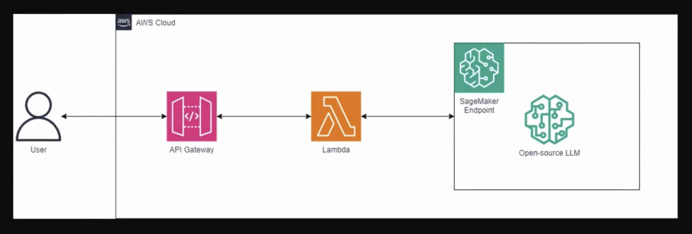

# NewClassifyPro

This project implement multiclass **_news_** text classification using **DistilBERT**.

## API Endpoint

The **NewsClassifyPro API** is **deployed** using **AWS API Gateway**.

**Endpoint** :- `https://aumwoknir1.execute-api.ap-south-1.amazonaws.com/dev/prediction-model`


## Frameworks, Libraries & Services : 
* Pytorch
* Hugging Face Transformers 
* Amazon SageMaker 
* AWS Lambda 
* Amazon S3 
* AWS API Gateway 
* AWS CloudWatch 


User can test this endpoint with the help of Postman by passing data in format to body:
```
{
    "query":
    {
        "headline": "THE-HEADLINE-OF-NEWS-ARTICLE-YOU-WANT-TO-TEST"
    }
}
```


# What's the goal?

To build a model that classifies news articles based on headlines of the news articles.

To train the model such that accuracy is above 95%.

Also, one of the key goal was to avoid overfitting.

# Architecture



# Result

By fine tuning the DistilBERT model and then training on the dataset we reached accuracy of 96.05%.

## Data

The model was trained on dataset [**_News Aggregator_**](https://archive.ics.uci.edu/dataset/359/news+aggregator).


